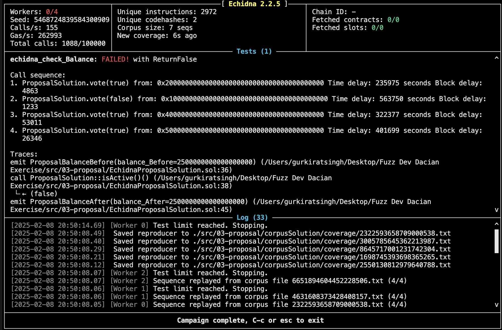

# Could Be Invariants 
1. The total number of the votes (For + againt) should not be greater than total number of voters 
2. If the votesFor  > votesAgainst, then users who have voted against should not recieve any rewards
3. Skeptical--(votesFor  > votesAgainst then voter who have votedFor should recieve the equal amount but in comments it's mentioned that is not possible their could be diffrenece of 1 wei)

but we could if the total amount recieved by the votesFor user all together is equal to total Reward eth

4. When the votesFor  < votesAgainst then we will give all amount back to the s_creator which should be equal to amount deposited by him


# Note
When defining invariants, ensure that they rely on publicly accessible state variables or variables that can be verified.As you could see the invariants listed above are not primarily based on state variables that are publicly accessible, which is why i had to make new smart contract `ProposalModified` and different echidna file `EchidnaProposalModified`.


# Solution 
As the fuzzer finds out the bug, the problem lies in which the quorum is being decided 
currently it implies greater than and equal to 

## Bug 1 Incorrect Quorum Calculation

[Reproducers File](./corpus/reproducers/error1.json)


The issue lies in how the quorum is determined in the `vote` function. The original logic only checks for a total vote count threshold but does not consider the ratio of `votesFor` and `votesAgainst`.

#### Faulty Implementation

``` Solidity 
if(totalCurrentVotes * 100 / s_totalAllowedVoters >= MIN_QUORUM) {
    // mark voting as having been completed
    s_votingComplete = true;

    // distribute the voting rewards
    _distributeRewards();
}
```

#### Corrected Implementation

``` Solidity    
if(totalCurrentVotes * 100 / s_totalAllowedVoters >= MIN_QUORUM) {
    // mark voting as having been completed
    uint256 votesForPercentage = s_votersFor.length * 100 / s_totalAllowedVoters;
    uint256 votesAgainstPercentage = s_votersAgainst.length * 100 / s_totalAllowedVoters;
    if(votesForPercentage > 50  || votesAgainstPercentage > 50){
        s_votingComplete = true;

        // distribute the voting rewards
        _distributeRewards();
    }
}
```
This ensures that the vote is only finalized when either votesFor or votesAgainst exceeds 50%.

## Bug 2 Incorrect Reward Calculation 

[Reproducers File](./corpusSolution/reproducers/error2.json)




#### Faulty Implementation

`uint256 totalVotes        = totalVotesFor + totalVotesAgainst;`
`uint256 rewardPerVoter = totalRewards / totalVotes;`


The issue here is that `rewardPerVoter` is calculated based on `totalVotes`, which includes both `votesFor` and `votesAgainst`. This results in some rewards being left in the contract, as the `_distributeRewards` function only pays out to `votesFor` voters.


``` Solidity 
if(i == totalVotesFor-1) {
    rewardPerVoter = Math.mulDiv(totalRewards, 1, totalVotes, Math.Rounding.Ceil);
}
_sendEth(s_votersFor[i], rewardPerVoter);
```

#### Corrected Implementation
``` Solidity 
function _distributeRewards() private {
        // get number of voters for & against
        uint256 totalVotesFor     = s_votersFor.length;
        uint256 totalVotesAgainst = s_votersAgainst.length;
        // uint256 totalVotes        = totalVotesFor + totalVotesAgainst;

        uint256 totalRewards = address(this).balance;


        if(totalVotesAgainst >= totalVotesFor) {
            _sendEth(s_creator, totalRewards);
        }

        else{
            uint256 rewardPerVoter = totalRewards / totalVotesFor;

            for(uint256 i; i<totalVotesFor; ++i) {
                if(i == totalVotesFor-1) {
                    rewardPerVoter = Math.mulDiv(totalRewards, 1, totalVotesFor, Math.Rounding.Ceil);
                }
                _sendEth(s_votersFor[i], rewardPerVoter);
            }
        }
}
```

In above the `totalVotes` has commeted out and the rewardsAre being decided number of persons who have `totalVotesFor`