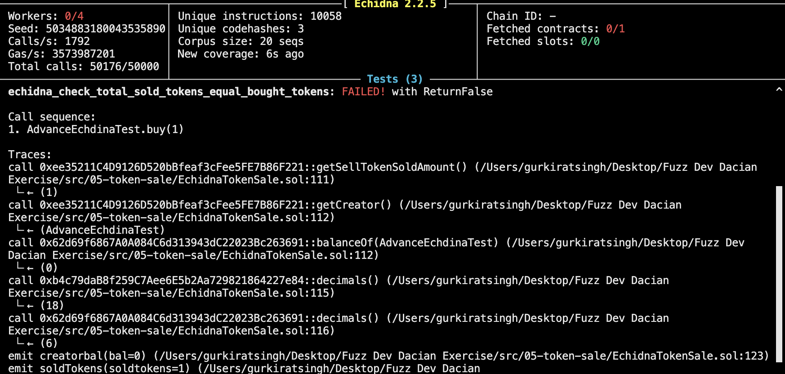
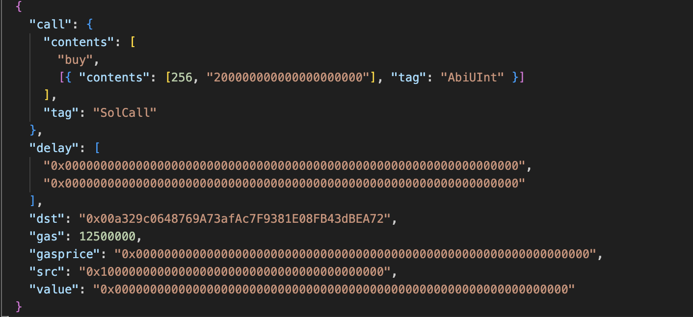
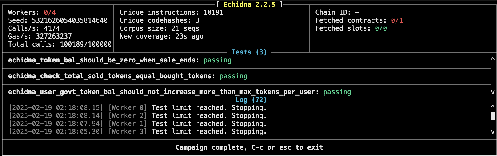

## Invariants Thinking 
1. Invariant when sale has ended the sell token balance of the contract should be zero 
2. The total buy tokens in the contract == total number of  total number of Sell tokens sold to users when sale has not ended. 


## Learning 
Echidna could find a bug easily if we guide it thorugh so it doesn't waste much time on view function.


## Bug 1: Division by Zero or Unexpected Rounding Issues



## Bug 2: Precision loss due to integer division in _convert().




## All The Tests Are Passing



If SELL_PRECISION > destDecimals_, we do:

### Faulty Implementation In `_convert()` Function

```Solidity
    amount_ = 1 / 10 ** (SELL_PRECISION - destDecimals_);
```
```Solidity
    amount_ = 1 / 10 ** (18 - 6);
```

Impact -- The function returns 0, causing unintended behavior in the buy function (e.g., no tokens issued, incorrect balances).


### Correct Implementation In `_convert()` Function

```Solidity
    amount_ = (amount_ * 10**SELL_PRECISION) / 10**destDecimals_;
```

Now we can 1 : 1 exhange could be handled flawlessly.


## Notes 
### Q-1 Why is sellTokenAmount >= MIN_FUNDING * 10^decimals Required?

### A-1
This requirement is in place to prevent an invalid or insignificant token sale.

Imagine a company selling shares in an IPO (Initial Public Offering). If they only put up 10 shares for sale, it wouldn't be a proper IPO. Similarly, the MIN_FUNDING rule makes sure that the contract has enough tokens to run a meaningful sale.

Breaking It Down

The rule in the constructor:

require(sellTokenAmount >= MIN_FUNDING * 10 ** sToken.decimals(), "TS: Minimum funding required");
This checks that the total number of tokens being sold (sellTokenAmount) is at least a required minimum amount (MIN_FUNDING).

Key Reasons for This Rule
Ensures a Minimum Sale Size
The contract must sell at least MIN_FUNDING tokens (multiplied by decimals).
Prevents people from accidentally or intentionally creating a sale with too few tokens.
Prevents Wasted Effort
If the contract only had, say, 5 tokens to sell, the whole sale would be pointless.
The MIN_FUNDING requirement forces the creator to fund the sale with a meaningful amount.
Protects Buyers
If a sale has too few tokens, it may not distribute tokens fairly or meet the demand.
This prevents unfair situations where some buyers can't buy enough tokens.
Example in Simple Terms

Let’s say MIN_FUNDING = 1000 and the token has 18 decimals.

If we write:

sellTokenAmount = 500e18;
This will fail because:

500e18 < 1000e18
✅ Correct way:
You must have at least:

sellTokenAmount = 1000e18; // This passes the check!
