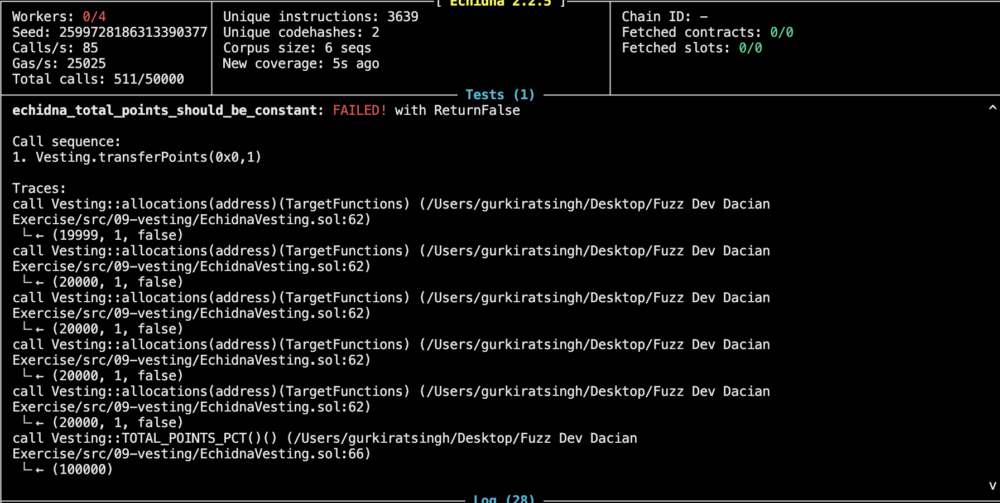
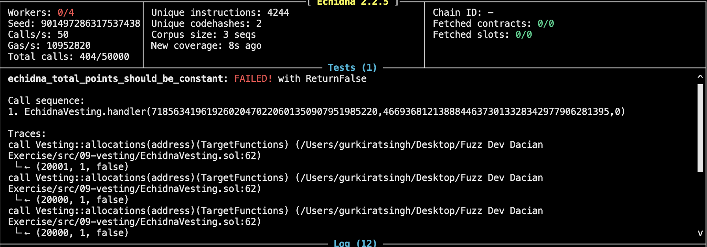
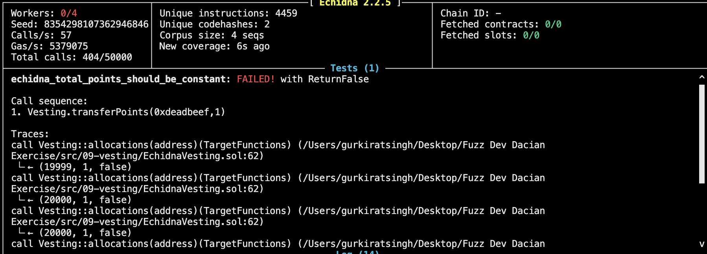

## Invariant Thinking
1. First invariant that TOTAL_POINTS_PCT should not be greater than 100_000
2. Any user should not be able to transfer after they have claimed (But this valid but since their is also a require statement for that in `transferPoints` function then it is just waste of fuzz runs. )

## Bug 1 Missing zero address check in `transferPoints` function.

When used testing without the handler it found a basic error, where users where able to send the points to the `address(0)`.

[Reproducers file](corpus/reproducers/496751183928588865.json) 


### Faulty Implementation

``` Solidity 
   function transferPoints(address to, uint24 points) external {
        require(points != 0, "Zero points invalid");

        AllocationData memory fromAllocation = allocations[msg.sender];
        require(fromAllocation.points >= points, "Insufficient points");
        require(!fromAllocation.claimed, "Already claimed");

        AllocationData memory toAllocation = allocations[to];
        require(!toAllocation.claimed, "Already claimed");
    ...
    }
```


### Correct Impelmentaion
adding a require statement

``` Solidity 
    function transferPoints(address to, uint24 points) external {
        require(points != 0, "Zero points invalid");
        require(to != address(0), "Address should not be zero");
        AllocationData memory fromAllocation = allocations[msg.sender];
        require(fromAllocation.points >= points, "Insufficient points");
        require(!fromAllocation.claimed, "Already claimed");

        AllocationData memory toAllocation = allocations[to];
        require(!toAllocation.claimed, "Already claimed");
    ...
    }
```

## Bug 2 Transfering to self 

***Understanding the bug*** -- When user transfer to self, first it subttracts the 1 point from msgsender (making 49999 in the memory) but the state doesn't update as it will update only after the function is successfully completed, so when adding the 1 point it adds to unchanged state (viz is still 50000) which increases the points  to 50001.

``` Solidity 
    allocations[msg.sender].points = 50,000 - 1;  // 49,999
    allocations[msg.sender].points = 50,000 + 1;  // 50,001
```

[Reproducer file](corpus/reproducers/1244362216987788404.json)



### Faulty Implementation

``` Solidity 
    function transferPoints(address to, uint24 points) external {
        require(points != 0, "Zero points invalid");
        require(to != address(0), "Address should not be zero");
        AllocationData memory fromAllocation = allocations[msg.sender];
        require(fromAllocation.points >= points, "Insufficient points");
        require(!fromAllocation.claimed, "Already claimed");

        AllocationData memory toAllocation = allocations[to];
        require(!toAllocation.claimed, "Already claimed");
    ...
    }
```


### Correct Implementation
Add a require statement which forbids to self transfer

``` Solidity 
    function transferPoints(address to, uint24 points) external {
        require(points != 0, "Zero points invalid");
        require(to != address(0), "Address should not be zero");
        require(msg.sender != to, "Cannot self transfer");
        AllocationData memory fromAllocation = allocations[msg.sender];
        require(fromAllocation.points >= points, "Insufficient points");
        require(!fromAllocation.claimed, "Already claimed");

        AllocationData memory toAllocation = allocations[to];
        require(!toAllocation.claimed, "Already claimed");
    ...
    }
```


# ***Note***

Since solved both the errors have been resolved, it was still able to call the `trasnferPoints` points function with `0xdeadbeef` and 
since i have made the `echidna_total_points_should_be_constant` invarinat function maximum limit upto 5 
and since the length of mapping could not be fetched, workaround could be done defining an array and in `transferPoints`
function checking if the user to whom the points are being sent if he present or not, if not than push new address to the address array array state variable that will be defined.

Below is the error 


