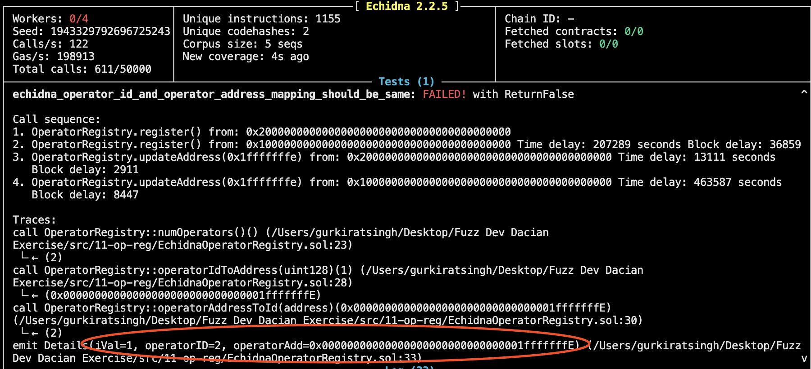
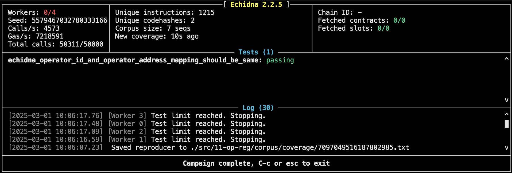

## Invariant Thinking 
Both the mappings should contain the same the address to id or vice a versa.

## Bug 1

[Reproducers File](corpus/reproducers/Error.json)


A operator could be registered twice when two individual operators call the `updateAddress(address newOperatorAddress)` with `newOperatorAddress` being same for both the operators.

### Faulty Implementation

``` Solidity 
    function updateAddress(address newOperatorAddress) external {
        require(msg.sender != newOperatorAddress, "Updated address must be different");

        uint128 operatorId = _getOperatorIdSafe(msg.sender);

        operatorAddressToId[newOperatorAddress] = operatorId;
        operatorIdToAddress[operatorId] = newOperatorAddress;

        delete operatorAddressToId[msg.sender];
    }
```


### Correct Implementation

``` Solidity 
    function updateAddress(address newOperatorAddress) external {
        require(msg.sender != newOperatorAddress, "Updated address must be different");
        // @audit added a require statement to check if the new Address that is being added should not be registered
        require(operatorAddressToId[newOperatorAddress] == 0, "Address already registered");
        uint128 operatorId = _getOperatorIdSafe(msg.sender);

        operatorAddressToId[newOperatorAddress] = operatorId;
        operatorIdToAddress[operatorId] = newOperatorAddress;

        delete operatorAddressToId[msg.sender];
    }
```


After Fixing the code no bug was found
