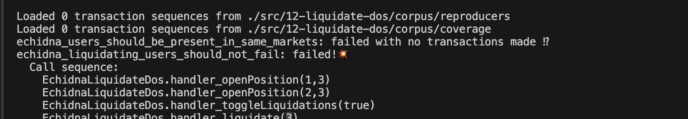
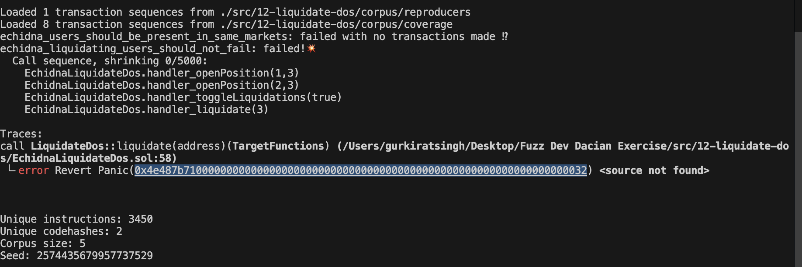
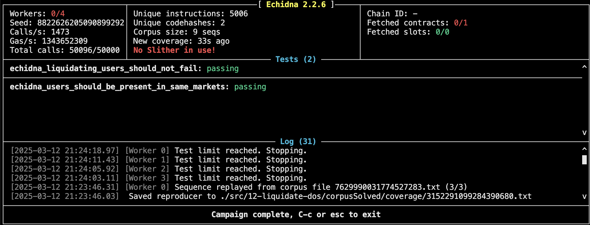

Notes 
If a a for loop comes try to test fuzzing for potential dos attack

This is the codebase where i learnt the most the on how to setup ghost variables and make the fuzz more efficient

How does the enumberableSet works 

how to setup the fuzz tests with errors could be catched.

Since in normal codebases while writing unit tests we know when to expect revert and we write it down but since in fuzzing we don't know what to expect we define errors in the handlers only.

This ctf taught how to setup the test suite if their is dos or a loop attack we have to check


since the error has been caught in the second invariant how to solve the below is by storing it in local variable




we could see in below how their is unknown function selector with the name of panic is their



the error is in the data set they are using which should be changed


## How EnumerableSet Stores Data

Internally, EnumerableSet maintains two mappings:

An array (_values) to store elements.
A mapping (_indexes) to track the index of each element.
When an item is added:

It is appended to _values[].
Its index is recorded in _indexes.
Example of Internal Storage
Let's say a user opens positions in markets {3, 7, 1}. EnumerableSet internally represents this as:

``` Solidity
    _values = [3, 7, 1];  
    _indexes = {3 => 1, 7 => 2, 1 => 3};
```

The indices in _indexes are 1-based (i.e., the first element has index 1, not 0).


## How EnumerableSet Removes Elements

When removing an element, instead of shifting all remaining elements (which would be expensive in gas), EnumerableSet swaps the last element into the removed element's slot, then shrinks the array.

Example: Removing 7
Before removal:

``` Solidity
    _values = [3, 7, 1];
    _indexes = {3 => 1, 7 => 2, 1 => 3};
```

After remove(7), EnumerableSet swaps 1 into 7's position:

``` Solidity
    _values = [3, 1];   // 7 is gone, but 1 moved to index 2
    _indexes = {3 => 1, 1 => 2}; // 7 is no longer tracked
```

Here’s what happens internally in remove(value):

Fetch the index of value from _indexes.
Swap the last element of _values into that index.
Update _indexes for the swapped element.
Remove the last element from _values.


## Why This Causes Issues in Your liquidate() Loop

Your `liquidate()` function iterates forward `(for(uint8 i; i<userActiveMarketsNum; i++))`, assuming that `at(i)` will always return the expected values.

### **The Problem**
If `userActiveMarkets[user].remove(marketId)` is called inside the loop, the array gets modified while iterating, leading to:

 - Indices shifting unpredictably.
 - Skipping elements (because swapping moves elements around).
 - Potential out-of-bounds errors if assumptions about length() are incorrect.

## Example of Breaking Behavior
Let's say userActiveMarkets[user] = {3, 7, 1}:

``` Solidity
for (uint8 i = 0; i < userActiveMarketsNum; i++) {
    uint8 marketId = uint8(userActiveMarkets[user].at(i));
    userActiveMarkets[user].remove(marketId);
}
```
Iteration Breakdown

1. i = 0, at(0) = 3, so remove(3).
    Now, 7 moves to 3's slot.
    _values = [7, 1].
2. i = 1, at(1) = 1, so remove(1).
    Now, 7 is skipped because 1 moved.
    _values = [7].
3. Loop terminates, but 7 is still in the set!


## Problem with current implementation of the function `liquidate`

- at(i) retrieves elements based on an internal array (_values).
- When remove() is called, it swaps the element to be removed with the last element, then removes it.
- This swapping means that the order of elements in _values is not preserved.
- If you loop through the set expecting a stable order, at(i) may give unexpected results after deletions.

## How Values Were Stored
The EnumerableSet implementation maintains two structures:

1. An array (_values) that stores the set elements.
2. A mapping (_indexes) that keeps track of where each element is in _values.


Example of Internal Storage
Before Removal:

``` Solidity
    _values  = [3, 6, 5, 9]
    _indexes = {3 → 0, 6 → 1, 5 → 2, 9 → 3}
```
Each number is stored in _values, and _indexes maps each number to its position in _values.

## How remove() Works

When removing an element:

1. Find the index of the element to remove from _indexes
2. Swap it with the last element in _values
3. Update _indexes to reflect the swap
4. Remove the last element (now the duplicate) from _values
5. Delete the _indexes entry for the removed element

Example: Removing 6

1. index_of_6 = _indexes[6] → 1
2. Swap 6 with the last element (9)
```Solidity 
    _values = [3, 9, 5, 6]  // Swap `6 ↔ 9`
```
3. Update _indexes for 9
```Solidity 
    _indexes[9] = 1  // `9` now occupies index `1`
```
4. Remove 6 from _values
```Solidity 
    _values = [3, 9, 5]  // `6` is gone
```

5. Delete _indexes[6]
```Solidity 
    delete _indexes[6]
```
After Removal:
```Solidity 
    _values  = [3, 9, 5]
    _indexes = {3 → 0, 9 → 1, 5 → 2}
```


### Why at(i) Was Changing

- at(i) retrieves elements from _values by index.
- Since remove() swaps the last element into the deleted spot, the order of _values changes.
- This means that iterating using at(i) may return elements in a different order than expected.

Example Issue:
- Initially: at(1) → 6
- After remove(6), at(1) → 9 because 9 took 6's place.

## Solution: Storing values() in Memory


**How the Fix Works**
Instead of accessing values() inside the loop, the solution stores the full list once in memory before iterating.


``` SOlidity
uint256[] memory userMarketIds = userActiveMarkets[user].values();
        
for (uint8 i; i < userActiveMarketsNum; i++) {
    userActiveMarkets[user].remove(userMarketIds[i]);
}
```

**Why This Fix Works**
- Prevents index shifting issues:

Since values() is stored in memory, it remains unchanged even if remove() modifies _values.
- Ensures all elements are removed:
The loop iterates over a fixed list, preventing skipped deletions.
- More efficient & predictable:
Accessing values() multiple times is more expensive in gas. Storing it in memory is more optimal.

